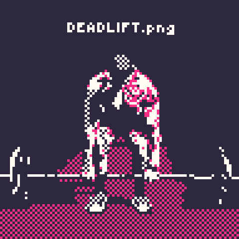

# deadlift-png <!-- left-padding -->


[][License]


An obsolete `left-pad` module (since ES2017 includes
[`String.prototype.padStart()`][padStart]).

## install

pnpm

```sh
pnpm add deadlift-png
```

npm

```sh
npm install deadlift-png
```

yarn

```sh
yarn add deadlift-png
```

## usage

```txt
leftPad :: Char -> Integer -> String -> String
```

The first argument is a `string` containing a single character to use
for padding the `string`. By default, the character used is a space
(" "). The second argument is an `integer` that represents the length of
the `string` after padding is added. If the `string` length is greater
than the given `number`, then the `string` is returned without
modification. The third and final argument is the `string` to pad.

```typescript
import { leftPad } from "deadlift-png"

const paddedString = leftPad()(13)("hello world") // => "  hello world"
const paddedNumber = leftPad("0")(3)(7)           // => "007"
const paddedDots = leftPad(".")(10)("hi")         // => "........hi"
const tooShort = leftPad()(3)("hello")            // => "hello"
```

[License]: https://git.sr.ht/~rasch/deadlift-png/blob/main/LICENSE
[padStart]: https://developer.mozilla.org/en-US/docs/Web/JavaScript/Reference/Global_Objects/String/padStart
